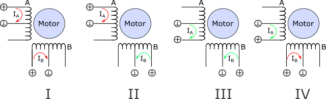
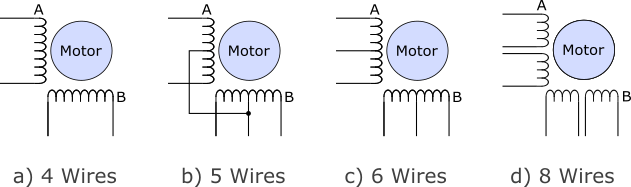
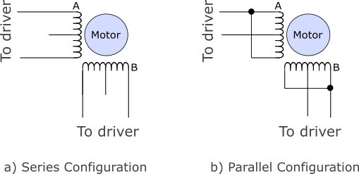
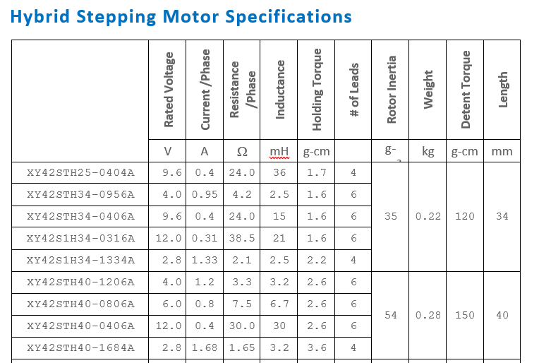
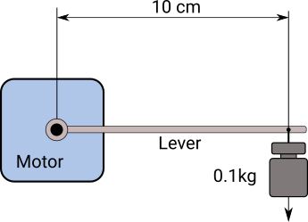

A lot of detailed information about stepper motors can be found online and doesn't need to be repeated here, e.g.:

- [Stepper Motor](https://en.wikipedia.org/wiki/Stepper_motor) - Wikipedia article
- [Stepper motors and stepper drivers](http://www.machinebuilding.net/ta/t0627.htm) - Bill Schweber from Mouser Electronics

## Motor Types

### Unipolar Steppers

Unipolar Steppers have a center tap on both coils. This allows for a simple drive electronics. You can keep the center tap at GND / 0V and alternately switch both ends of the 
coil to the operating voltage. Opposed to bipolar types there is no need to reverse the polarity of the driving voltage. 
A simple full step stepping sequence is shown in the figure below: 

 

However, since only half of a coil is energized at a time this leads to a less efficient operation compared to the bipolar scheme below. 

### Bipolar Steppers

Most modern steppers are of the bipolar type. For bipolar steppers the current through the coils A and B needs to be reversed from step to step. 
A simple full step stepping sequence is shwon in the figure below: 

 

### Wiring types

The following figure shows usual wiring configurations for unipolar and bipolar steppers.

 

 
- Motors intended for bipolar operation are usually assembled in a 4 wire configuration. 
- The 5 wire configuration can be operated in unipolar mode only.  The cheap geared stepper 28BYJ-48 is a popular representative of this motor type. 
  {:width="300"}  
  Please note that the omnipresent stepper drivers DRV8825, A4998, TB6600... are bipolar types and can not be used for this kind of steppers.

- The 6 and 8 wire configurations can be driven by unipolar and bipolar drivers. 
  If you want to drive such a stepper in bipolar mode you can either connect the coils in series (high torque, low speed) or in parallel (low torque, high speed).  
 

## Mechanical Paramters

The National Electrical Manufacturers Association ([NEMA](https://www.nema.org/pages/default.aspx)) standardized motor frame sizes for the global "inch" market 
([NEMA ICS 16](https://www.nema.org/Standards/SecureDocuments/ICS16.pdf)) In that standard the well known NEMA number denotes the outer flange dimensions in units of 0.1 inch. 
E.g, a NEMA17 motor has a square flange size of 1.7 inch. 
The following table lists typical dimensions and typical torque ranges for various NEMA motor sizes. In case you 
want to do some mechanical design, you find links to free 3d models in the last column of the table. (Please note: motors with NEMA numbers in parentheses are not part of the official standard). 

| NEMA | Flange &#x2B1C; inch/mm |Register &empty; mm|Mounting &#x2B1C; mm | Thread/ hole | Shaft &empty; mm|Torque (typ) Nm| 3d data|
|:----:|:---------------------------------------:|:---------------------------------:|:-----------------------------------:|:---------------:|:-----------:|:-------------:|:---------------:|
| (08) | 0.8 / 20.0                              | 15.0/16.0                         | 16/15.4                             | M2              |  4.0        | 0.018 - 0.036 |[3d](https://grabcad.com/library/tag/nema8) |
| (11) | 1.1 / 28.0                              | 22.0                              | 23.0                                | M2.5            |  5.0        | 0.03 - 0.14   |[3d](https://grabcad.com/library/tag/nema11)|
| (14) | 1.4 / 35.0                              | 22.0                              | 26.0                                | M3              |  5.0        | 0.05 - 0.40   |[3d](https://grabcad.com/library/tag/nema14)|
|  17  | 1.7 / 42.0                              | 22.0                              | 31.0                                | M3              |  5.0        | 0.15 - 1.00   |[3d](https://grabcad.com/library/tag/nema17)|
|  23  | 2.3 / 56.4                              | 38.1                              | 47.14                               | 4.5 mm          |  6.35/8     | 0.40 - 3.40   |[3d](https://grabcad.com/library/tag/nema23)|
|  34  | 3.4 / 86.0                              | 73.0                              | 69.58                               | 6.5 mm          |  14.0       | 2.50 - 14.0   |[3d](https://grabcad.com/library/tag/nema34)|
|  42  | 4.2 / 106.0                             | 55.5                              | 88.88                               | 8.5 mm          |  19.0       | 12.0 - 30.0   |[3d](https://grabcad.com/library/tag/nema34)|   

The torque in the table is given in the SI unit Nm (Newton x meter). Interestingly, torque seems to be one of the last playgrounds for obscure imperial units. 
There is lb-ft (foot-pound), oz-in (ounce-force-inch) and much more... Fortunately, useful [online conversion](http://www.numberfactory.com/nf%20torque.htm) tools exist.

## Electrical Parameters

Lets have a look at a typical datasheet, defining the properties of a series of stepper motors (XY42STHXX, NEMA17, click on the table to open the full datasheet). 

The main electrical parameter of a stepper is its **rated current** given in col. 2. Together with the coil **inductance** (col. 4) it generates the magnetic field and thus the 
force which moves the motor. In static conditions this current is only limited by the **resistance** of the coils (col. 3), so that the **rated voltage** U (col. 1) is given by ohms 
law U = R * I.  (E.g, for the first line in the table we get U = 0.4A * 24&#x2126; = 9.6V). The **holding torque** is the torque the motor generates at standstill when operated 
with its rated current and the **detent torque** is the amount of torque the motor produces when the windings are not energized. The effect of the detent torque can be felt when moving the motor 
shaft by hand. ([see here  for details](https://www.motioncontroltips.com/faq-whats-the-difference-between-detent-torque-and-holding-torque/))

**What parameters do I need?**   
- First, determine the required motor torque. For a first estimation, the following might help: A motor with a torque of 1kg-cm (~0.1Nm) can lift a mass of 1kg attached on a 1cm lever. 
Equivalently, it can lift a mass of 0.1kg attached on a 10cm lever or a 200g mass on a 5cm lever).
  {:height="200"}

- If you need the stepper for a high speed application, choose one with an inductance as small as possible. However, the smaller the inductance the larger the current required to generate 
the needed torque. You usually drive such motors with a constant current driver (DRV8825, TB6600...). Make sure that your driver is capable of providing the large current. 
If not, you might need to choose a motor with a higher inductance at the price of a lower speed (or a larger driver). 

- If you want to drive the motor with a constant voltage, look for steppers with a rated voltage equal to your driving voltage. Those motors typically have a high inductivity and need not much 
current. However, the large inductivity does not allow those motors to run very fast. 

**Example:**   
We are looking for a high speed, 2kg-cm motor for a DRV8825 driver. The torque requirement leads us to lines 5 - 10 in the datasheet above. Due to the speed requirement we look for
the motor with the lowest inductance available which is the XY42S1H34-1334A (line 5) with 2.5 mH. It needs a current of about 1.3A which is fine for our driver. 

