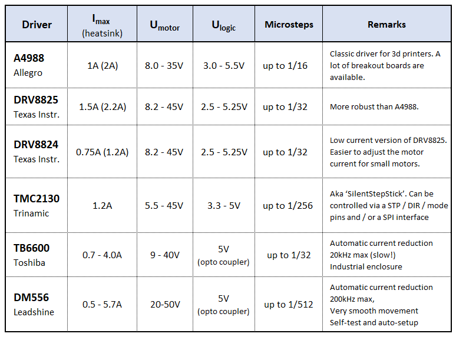

Operating a stepper always requires some kind of driving electronics to energize the motor coils. In the
most simple case this can be 4 transistors connected to a unipolar constant voltage stepper.
<!-- 
{:height="200"}   
<small>([https://coeleveld.com/arduino-stepper-uln2003a/](https://coeleveld.com/arduino-stepper-uln2003a/))<small> -->
Anyway, these days stepper drivers with a much better performance and an easy to use STEP / DIR
interface are readily available for steppers of all types and sizes. 

## Constant Current Drivers

Most of the modern stepper drivers used in hobby applications are developed for bipolar steppers and
operate in constant current mode. In the table below you find a few popular devices and their key specifications. 

<!-- 

| Type     | Imax [A] <small>(heat sink)</small>| Umotor [V]| Ulogic [V] | Microsteps | Remarks |
|:---------|:------------------------------|:---------------:|:------------------|:----------:|---------|
|A4988     | 1A (2A)                       | 8.0 - 35        | 3.0 - 5.5V        | up to 1/16 | <small>classic driver for 3d printers</small>   | 
|DRV8825   | 1.5A (2.2A)                   | 8.2 - 45        | 2.5 - 5.25V       | up to 1/32 |        | 
|DRV8824   | 0.75A (1.2A)                  | 8.2 - 45        | 2.5 - 5.25V       | up to 1/32 | <small>low current version of DRV8825</small> |
|TMC2130   | 1.2A                          | 5.5 - 45        | 3.3 - 5V          | up to 1/256| <small>aka 'SilentStepStick'  STP/DIR and SPI interface </small> |
|TB6600 |

 -->

TBC

## Constant Voltage Drivers

<!-- 
Apply the rated voltage V to the coils. Usually this voltage is given in the motor datasheet.
Alternatively you can calculate it from the coil resistance R and the rated coil current `I` by
[Ohms law](http://www.ohmslawcalculator.com/ohms-law-calculator)). Motors designed for voltage
control require a relatively high resistance which typically is achieved by a high number of coil
windings leading to a high inductance of the motor (see values in the example datasheet below)
    
*Advantage:*   
Simple drive electronics. Combined with a unipolar wiring you can drive a voltage controlled stepper
by 4 transistors or a simple [ULN2003](https://www.st.com/resource/en/datasheet/uln2001.pdf)
circuit.   
*Disadvantage:*   
Due to the relatively high inductance of those motors they can not be used for high speed
applications    [Here](https://coeleveld.com/arduino-stepper-uln2003a/) you find a nice
writeup describing the method.   
{:height="250"}
{:height="250"}
 -->

## Logic Level Conversion

## Performance

