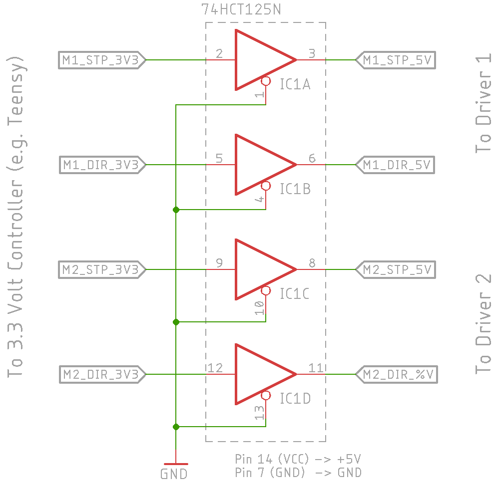
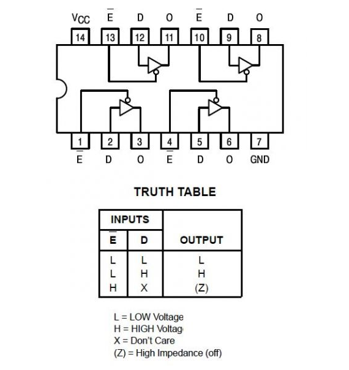
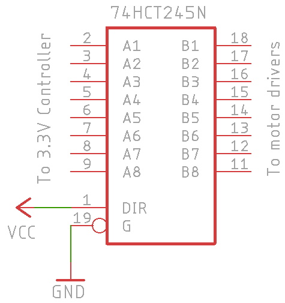
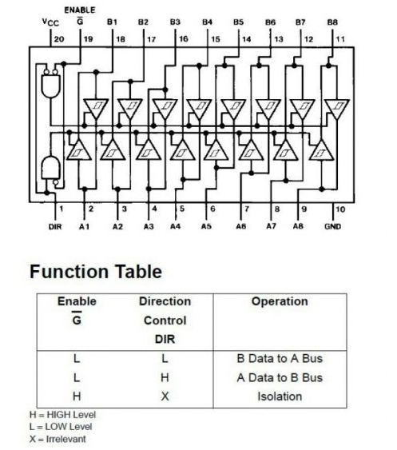

Operating a stepper always requires some kind of driving electronics to energize the motor coils. In the
most simple case this can be 4 transistors connected to a unipolar constant voltage stepper.
Anyway, these days stepper drivers with a much better performance and an easy to use STEP / DIR
interface are readily available for steppers of all types and sizes. 

## Constant Current Drivers

Most of the modern stepper drivers are developed for bipolar steppers and
operate in constant current mode. The table below shows a few popular devices and their key specifications. 

## Logic Level Conversion

The control signals of a Stepper driver with a 3.3V logic interface can be connected to a Teensy (or
any other 3.3V output controller) directly. For drivers with a 5V or an opto-coupled input you need
a level shifter to connect them to a 3.3V controller. The figure below shows how to do that with a
[74HCT125](https://octopart.com/search?q=74hct125%20) containing 4 buffers which accept 3.3V input
signals and generate 5V output signals. 

[{:width="50%"}](assets/74hct125.png)
[{:width="45%"}](assets/74hct125_pinout.png)

Alternatively you can use a [74HCT245](https://octopart.com/search?q=74hct245%20) which contains 8
buffers. The DIR pin of that chip defines the buffer direction. Set it to VCC for A->B or to GND for
B->A. 

[{:width="40%"}](assets/74hct245.png)
[{:width="45%"}](assets/74hct245_pinout.png)

Note: For both ICs make sure to connect the VCC pin to the 5V supply. 

## Constant Voltage Drivers

If you need to drive a constant voltage motor like the cheap and very popular
[28BYJ-48](https://octopart.com/search?q=28byj-48) you can simply use four transistors, a integrated
Darlington driver like the [ULN2003](https://www.st.com/resource/en/datasheet/uln2001.pdf) or an
integrated H-bridge module like the [L298](https://octopart.com/search?q=28byj-48).   

{:height="250"}
{:height="250"}

[Here](https://coeleveld.com/arduino-stepper-uln2003a/) you find a nice writeup describing the
method.

